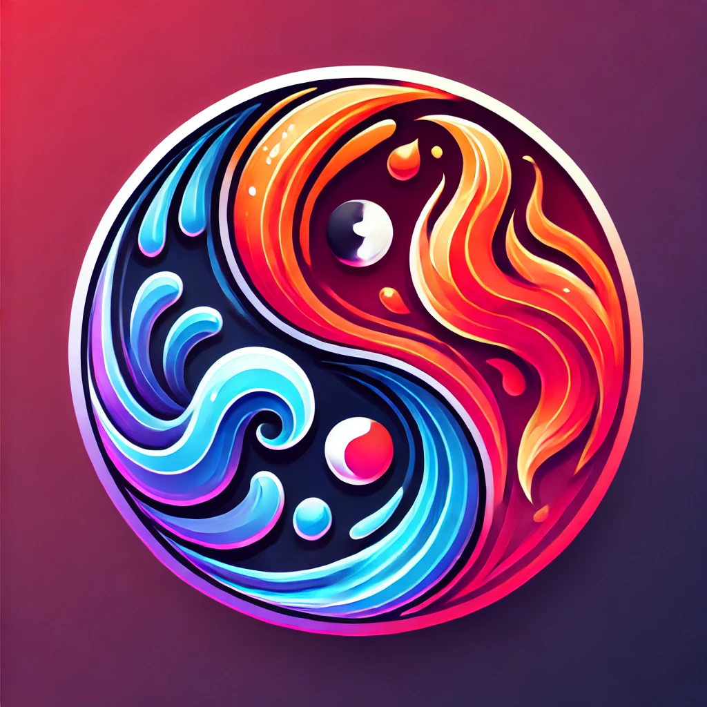

**Art Portfolio Project**

This dynamic art portfolio showcases a collection of captivating fantasy characters, including iconic figures like those from "Lord of the Rings" and "Mother of Dragons." Utilizing Node.js for the backend and React.js for the frontend, the website offers a seamless user experience across its three main pages: Home, Full Gallery, and About the Artist.

### Features

- **Home Page**: Displays an overview of the artwork with a featured character and an elegant, animated logo.
- **Full Gallery**: Users can browse through an extensive gallery, where each character image provides a brief description upon clicking, immersing users in the fantasy narratives.
- **About the Artist**: Delivers insights into the artist’s background, inspirations, and creative journey.

The interactive design ensures an intuitive navigation experience, making it easy for users to explore and appreciate the art. The incorporation of an animated logo adds a touch of flair, enhancing the visual appeal and engagement. A demo of the website is given in the video below.
[](https://www.loom.com/share/96cf070bbb53440c85eb246584d839e9?sid=e884ee97-a1d3-446f-bb37-ac096dfa1bb5)
[](https://go.screenpal.com/watch/cTVqbPnfid2)


This is a [Next.js](https://nextjs.org) project bootstrapped with [`create-next-app`](https://nextjs.org/docs/app/api-reference/cli/create-next-app).

## Getting Started

First, run the development server:

```bash
npm run dev
# or
yarn dev
# or
pnpm dev
# or
bun dev
```

Open [http://localhost:3000](http://localhost:3000) with your browser to see the result.

You can start editing the page by modifying `app/page.tsx`. The page auto-updates as you edit the file.

This project uses [`next/font`](https://nextjs.org/docs/app/building-your-application/optimizing/fonts) to automatically optimize and load [Geist](https://vercel.com/font), a new font family for Vercel.

## Learn More

To learn more about Next.js, take a look at the following resources:

- [Next.js Documentation](https://nextjs.org/docs) - learn about Next.js features and API.
- [Learn Next.js](https://nextjs.org/learn) - an interactive Next.js tutorial.

You can check out [the Next.js GitHub repository](https://github.com/vercel/next.js) - your feedback and contributions are welcome!

## Deploy on Vercel

The easiest way to deploy your Next.js app is to use the [Vercel Platform](https://vercel.com/new?utm_medium=default-template&filter=next.js&utm_source=create-next-app&utm_campaign=create-next-app-readme) from the creators of Next.js.

Check out our [Next.js deployment documentation](https://nextjs.org/docs/app/building-your-application/deploying) for more details.
